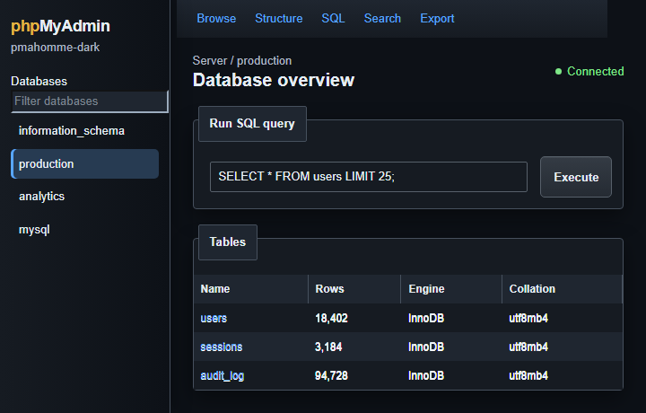

# pmahomme-dark

[Русская версия](README.ru.md)

A dark graphite theme for phpMyAdmin, based on the default `pmahomme` theme.

This is an independent community project. It is not an official phpMyAdmin
release and is not endorsed or supported by the phpMyAdmin project.



## About

`pmahomme-dark` gives phpMyAdmin a consistent dark interface while preserving the familiar layout of the default theme. It includes dark styles for navigation, tables, forms, dialogs, alerts, the SQL editor, the console, Designer, and other common interface elements.

## Compatibility

- phpMyAdmin 5.0, 5.1, and 5.2
- Theme version: 1.0
- LTR and RTL layouts

## Installation

1. Download this repository using **Code → Download ZIP**, or clone it with Git.
2. Make sure the extracted directory is named `pmahomme-dark`.
3. Copy the entire directory into the `themes` directory of your phpMyAdmin installation:

   ```text
   phpMyAdmin/
   └── themes/
       └── pmahomme-dark/
           ├── css/
           ├── img/
           ├── jquery/
           ├── scss/
           └── theme.json
   ```

4. Open phpMyAdmin and select **pmahomme-dark** from the **Theme** selector on the home page.

Do not replace or remove the original `pmahomme` directory. The new theme must be installed alongside it.

### Make it the default theme

Add the following setting to `config.inc.php`:

```php
$cfg['ThemeDefault'] = 'pmahomme-dark';
```

If the theme selector is not visible, make sure the theme manager is enabled:

```php
$cfg['ThemeManager'] = true;
```

For more details, see the [official phpMyAdmin custom themes documentation](https://docs.phpmyadmin.net/en/release_5_2_3/themes.html).

## Updating

Replace the existing `themes/pmahomme-dark` directory with the files from the new version, then refresh phpMyAdmin. If old styles remain, clear your browser cache.

## Uninstalling

Switch to another theme first, then remove the `themes/pmahomme-dark` directory. Also remove or change the `ThemeDefault` setting if you added it.

## Origin and modifications

The theme is derived from the `pmahomme` theme shipped with phpMyAdmin 5.2.3.
The original theme is copyrighted by its respective phpMyAdmin contributors. Dark
palette, styling changes, generated stylesheets, metadata, documentation, and
the preview image were added or modified by Fakeman Cat on August 18, 2026.

See [THIRD_PARTY_NOTICES.md](THIRD_PARTY_NOTICES.md) for upstream attribution
and licenses that apply to bundled third-party assets.

## License

Except for the third-party components identified separately, the theme code
and original modifications are distributed under the GNU General Public
License, version 2 only (`GPL-2.0-only`). See [LICENSE](LICENSE) for the
complete GPL terms and [THIRD_PARTY_NOTICES.md](THIRD_PARTY_NOTICES.md) for
the licenses retained by bundled third-party components.
